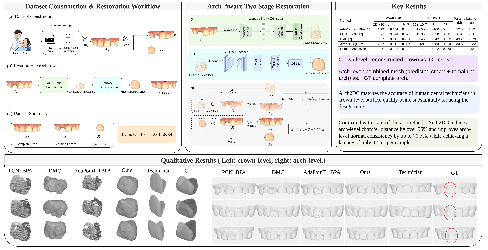

<div align="center">

# Arch2DC

**Arch-Aware Two-Stage Dental Crown Restoration with Local-Global Dual Constraints**

<!--[](https://github.com/XavierJiezou/Arch2DC)-->
<!--[](https://huggingface.co/XavierJiezou/arch2dc-models)-->

</div>

---

## Overview

**Arch2DC** is a two-stage arch-aware framework for automatic missing dental crown restoration. Given a defective intraoral arch scan, it:

1. **Stage I** — Predicts the missing crown point cloud and RGB color using an AdaPoinTr-based completion module with local–global dual-constraint supervision (α = 0.8).
2. **Stage II** — Reconstructs a continuous triangular mesh from the predicted point cloud using an SAP-based module with dual-constraint supervision (β = 0.9, δ = 0.05).

Compared with existing methods, Arch2DC achieves:
- **>96% reduction** in arch-level Chamfer distance
- **Up to ~70.7% improvement** in arch-level normal consistency
- **32 ms** per-sample inference latency — substantially faster than manual fabrication
- Crown-level surface quality matching human dental technicians




## Resources

| Resource | Link |
|----------|------|
| 🤗 Pretrained Models | [XavierJiezou/arch2dc-models](https://huggingface.co/XavierJiezou/arch2dc-models) |

## Environment Setup

```bash
wget https://huggingface.co/XavierJiezou/arch2dc-models/resolve/main/environment.yml
conda env create -f environment.yml
conda activate tooth
```

## Pretrained Models

Download from [HuggingFace](https://huggingface.co/XavierJiezou/arch2dc-models):

```bash
huggingface-cli download XavierJiezou/arch2dc-models --local-dir ./checkpoints
```

| File | Description |
|------|-------------|
| `arch2dc/stage1_best_l1_cd.pth` | Ours Stage I (AdaPoinTr + global, α=0.8) |
| `arch2dc/stage2_model_best.pt` | Ours Stage II (SAP dual-constraint, β=0.9, δ=0.05) |
| `stage1_pcn/best_l1_cd.pth` | PCN baseline Stage I |
| `stage1_adapointr_bpa/best_l1_cd.pth` | AdaPoinTr+BPA baseline Stage I |
| `dmc/best_val.pth` | DMC baseline |

## Training

**Stage I — Point Cloud Completion:**

```bash
python train.py \
    --exp_name arch2dc_stage1 \
    --num_query 512 \
    --global_feature_dim 1024 \
    --w_global 0.2 \
    --lr 0.0001 \
    --epochs 200 \
    --batch_size 8
```

**Stage II — Surface Reconstruction:**

```bash
python train_sap.py \
    --config configs/tooth_dual/ours.yaml \
    --w_global 0.1 \
    --global_dist_threshold 0.05 \
    --epochs 100 \
    --batch_size 8
```

## Inference

End-to-end restoration of a missing crown from a defective intraoral arch scan:

```bash
# 1) Stage I — predict the missing crown point cloud (+RGB) from the defective arch
python inference_stage1.py \
    --ckpt ./checkpoints/arch2dc/stage1_best_l1_cd.pth \
    --input  path/to/defective_arch.ply \
    --output ./outputs/crown_pred.ply

# 2) Stage II — reconstruct the continuous crown mesh from the predicted point cloud
python inference_stage2.py \
    --ckpt ./checkpoints/arch2dc/stage2_model_best.pt \
    --input  ./outputs/crown_pred.ply \
    --output ./outputs/crown_mesh.ply
```

Notes:
- The input is a normalized intraoral arch scan with one crown missing (`ply` format).
- Stage I samples `N=4096` input points and predicts `M=2048` crown points; Stage II reconstructs the mesh via SAP differentiable Poisson surface reconstruction.
- Per-sample latency is about **32 ms** on a single NVIDIA RTX 3090.

## Evaluation

```bash
# Stage I evaluation
python eval.py --exp_name arch2dc_stage1 --save True

# Stage II evaluation
python eval_sap.py --config configs/tooth_dual/ours.yaml
```

## Main Results

Crown-level: reconstructed crown vs. GT crown. Arch-level: combined mesh (predicted crown + remaining arch) vs. GT complete arch. CD values are scaled by 10⁻². Latency is per-sample inference time on a single NVIDIA RTX 3090; † denotes Stage II using the CPU-based Ball-Pivoting Algorithm (BPA). **Bold** = best, <u>underline</u> = second-best.

| Method | Crown CD↓ | Crown F-score↑ | Crown NC↑ | Arch CD↓ | Arch F-score↑ | Arch NC↑ | Params (M) | Latency (s) |
|--------|:---------:|:--------------:|:---------:|:--------:|:-------------:|:--------:|:----------:|:-----------:|
| AdaPoinTr + BPA | **1.72** | **0.364** | <u>0.736</u> | 19.50 | 0.106 | 0.651 | <u>32.5</u> | 1.79† |
| PCN + BPA | <u>1.97</u> | 0.324 | 0.678 | 19.38 | 0.098 | 0.611 | **6.9** | 1.78† |
| DMC | 3.97 | 0.146 | 0.731 | 21.48 | 0.043 | 0.559 | 43.2 | <u>0.079</u> |
| **Arch2DC (Ours)** | 2.57 | 0.312 | **0.827** | **0.69** | **0.883** | <u>0.954</u> | 33.5 | **0.032** |
| Human Technician | 2.90 | <u>0.326</u> | 0.688 | <u>0.71</u> | <u>0.822</u> | **0.973** | — | ~420 |

Key takeaways: Arch2DC reduces arch-level CD by **>96%** over all learning-based baselines, raises the arch-level F-score to **0.883** (an 8–20× improvement), and attains the best crown-level NC (**0.827**), all while matching human-technician crown-level surface quality at a fraction of the time.

<!-- ## Citation

```bibtex
@article{arch2dc2025,
  title={Arch2DC: Arch-Aware Two-Stage Dental Crown Restoration with Local-Global Dual Constraints},
  author={XavierJiezou et al.},
  journal={},
  year={2025}
}
``` -->

## Acknowledgements

- [AdaPoinTr](https://github.com/yuxumin/PoinTr)
- [Shape As Points (SAP)](https://github.com/autonomousvision/shape_as_points)
- [DMC](https://github.com/lmb-freiburg/DMC)
